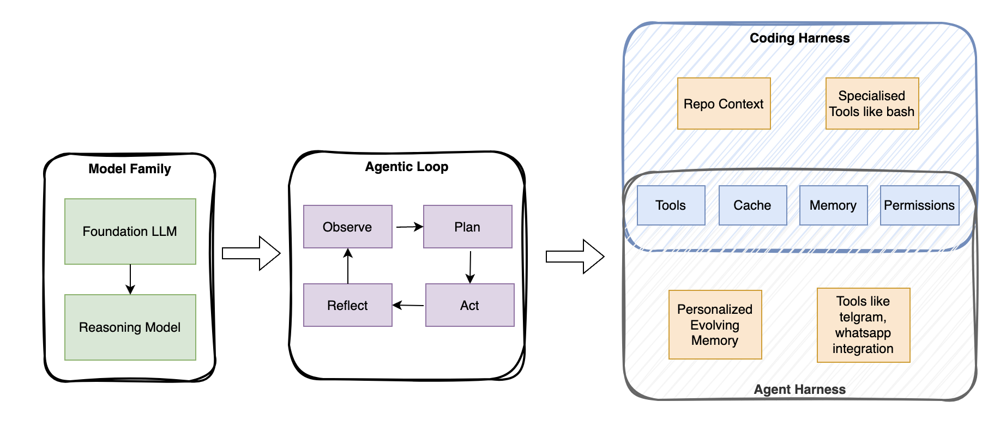
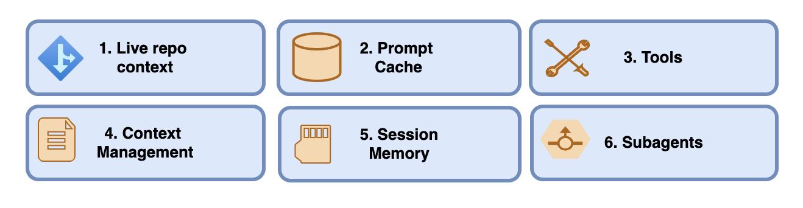
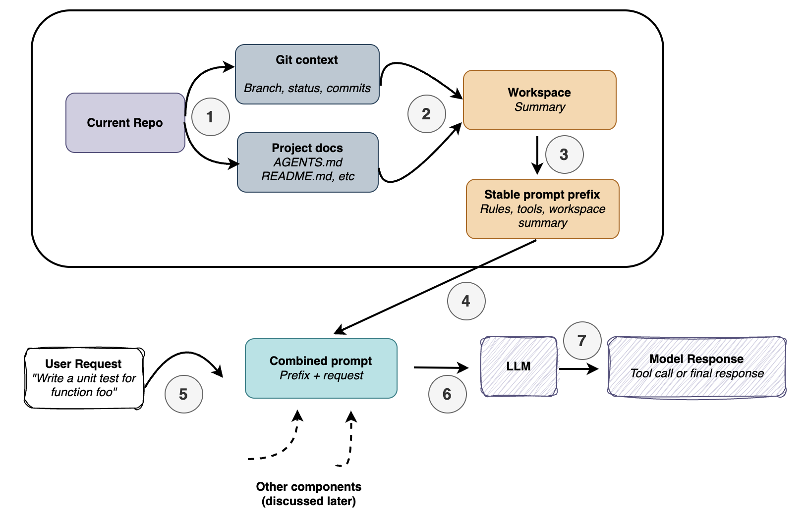
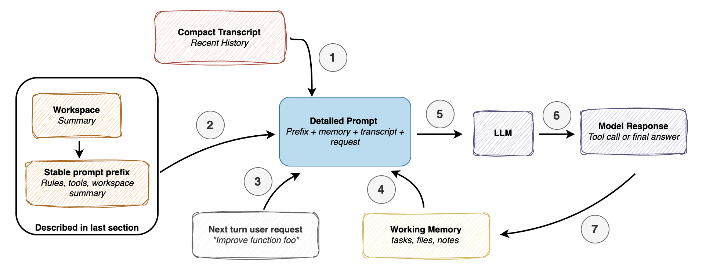
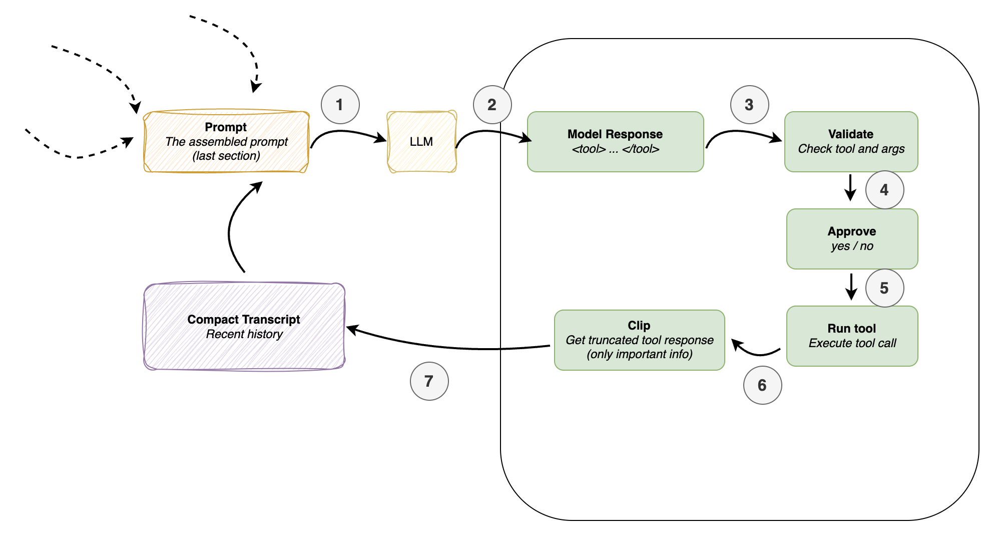
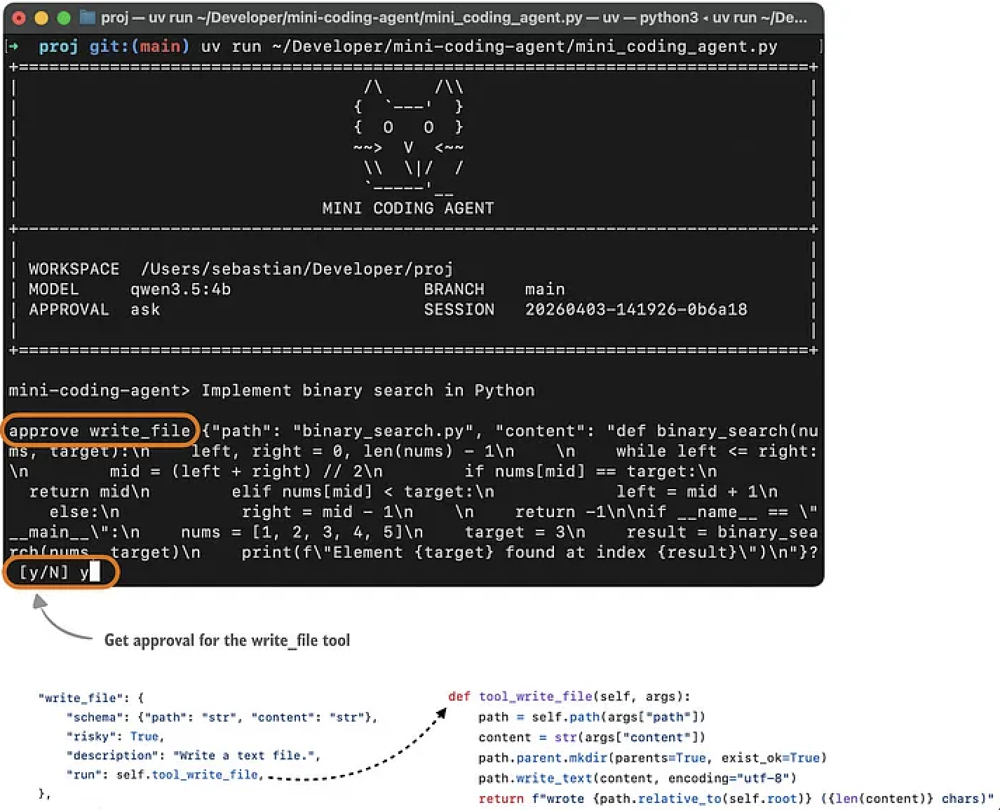
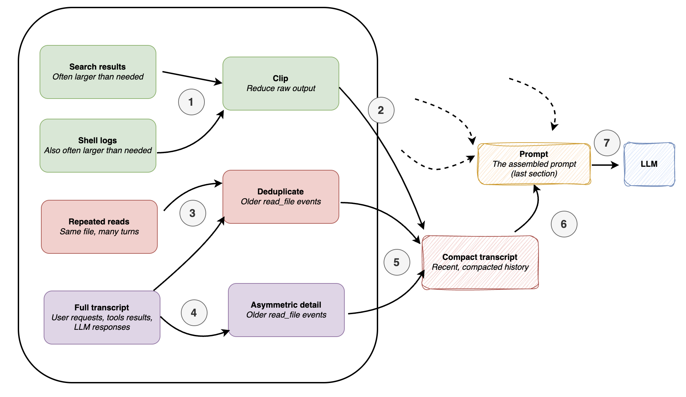
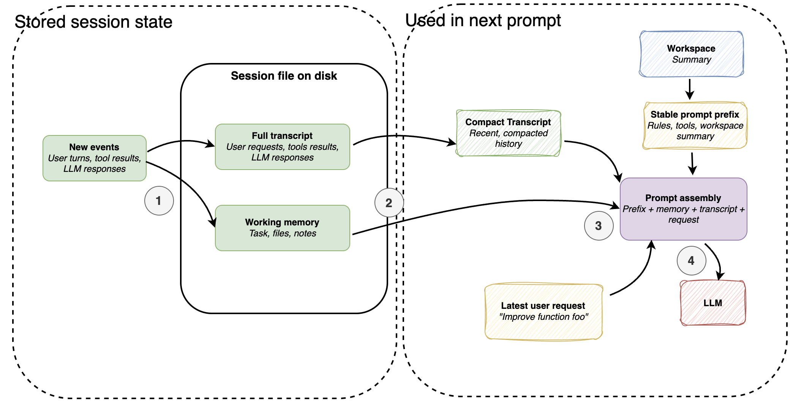
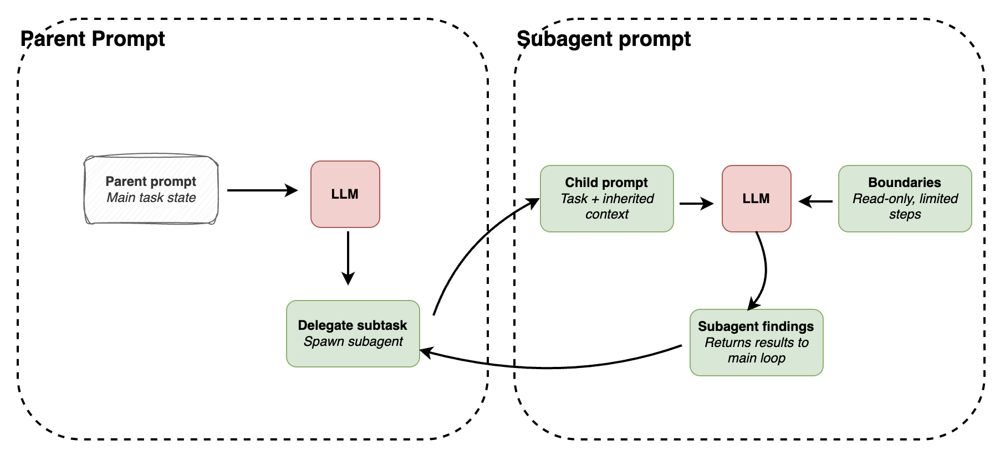

## How coding agents make LLMs work better in practice with tools use, memory, and repo context
“AI agents will transform the way we interact with technology, making it more natural and intuitive. They will enable
us to have more meaningful and productive interactions with computers.” — Fei-Fei Li, Professor of
Computer Science at Stanford University

Agents have become an pervasive topic because much of the recent progress in practical LLM systems is
not just about better models, but about how we use them. In many real-world applications, the surrounding system,
such as tool use, context management, and memory, plays as much of a role as the model itself.
This also helps explain why systems like Claude Code or Codex can feel significantly more capable
than the same models used in a plain chat interface.

In this article, we will discuss, six of the main building blocks of a coding agent.

## Coding Agents — Claude Code, Codex CLI, and others
You are probably used or familiar with Claude Code or the Codex CLI, but just to set the stage — they are
agentic coding-productivity tools that wrap an LLM or their evolved cousins — in an application layer, a so-called
agentic harness, to be more convenient and better-performing for coding tasks.

Coding agents are engineered for software work where usage pleasantness is not defined only by the model
choice but the surrounding system, including repo context, tool design, prompt-cache stability, memory,
and long-session continuity.

That distinction matters because when we talk about the coding capabilities of LLMs, people often collapse
the model, the reasoning behavior, and the agent product into one thing. But before getting into the
coding agent specifics, it’s important to add more context on the difference between the broader concepts,
the LLMs, reasoning models, and agents.

## LLMs, Reasoning Models, and Agents
At its core, an LLM is a next-token prediction model. A reasoning model is still an LLM, but one trained and/or
prompted to spend more inference-time compute on intermediate reasoning, self-verification, or search over candidate
answers before settling on a response.

An agent is a layer on top of this. It’s best understood as a control loop wrapped around the model — one that,
given a goal, decides what to inspect next, which tools to call, how to update state, and when to stop.

A rough analogy: the LLM is the engine, a reasoning model is a more powerful (and more expensive) version of that engine,
and the agent harness is what actually drives toward a goal using whichever engine is under the hood.

More precisely, the key terms break down like this:

- **LLM**: the raw model
- **Reasoning model**: an LLM optimized to produce intermediate reasoning traces and verify its own outputs
- **Agent**: a loop that repeatedly calls a model within an environment, using tools, memory, and feedback to steer toward a goal
- **Agent harness**: the software scaffold managing context, tool use, prompts, state, and control flow around an agent
- **Coding harness**: a task-specific agent harness built for software engineering — managing code context, tools,
execution, and iterative feedback

A coding harness is the narrower, specialized case; an agent harness is the broader category (OpenClaw, for instance,
is an agent harness). Codex and Claude Code are coding harnesses.

A better LLM gives a reasoning model a stronger foundation, and a well-built harness gets more out of that reasoning
model. That said, LLMs and reasoning models can handle coding tasks on their own — but coding is only partly about
next-token generation. Much of the work involves repo navigation, symbol lookup, search, diff application, test
execution, and error inspection. That’s what a harness is for.

The takeaway here is that a good coding harness can make a reasoning and a non-reasoning model feel much stronger than
it does in a plain chat box, because it helps with context management and more.

## The Coding Harness
As covered in the previous section, the harness refers to the software layer surrounding the model —
the part that assembles prompts, exposes tools, tracks file state, applies edits, runs commands, manages permissions,
caches stable prefixes, stores memory, and much more.

Today, this layer accounts for most of the difference in user experience between a capable coding assistant and simply
prompting a model directly or using a web chat UI (which is closer to “chat with uploaded files” than anything
resembling an agent).

As frontier LLMs converge in raw capability — the base versions of models like GPT-5.4, Opus 4.6, and GLM-5 are
increasingly similar out of the box — the harness often becomes the real differentiator. The same underlying model can
feel dramatically more or less capable depending on how well the surrounding scaffold is built.

By the way, in this article, the terms “coding agent” and “coding harness” are somewhat interchangeably for simplicity.
(Strictly speaking, the agent is the model-driven decision-making loop, while the harness is the surrounding
software scaffold that provides context, tools, and execution support.)

Below are six main components of coding agents.
1) Live Repo Context -> WorkspaceContext
2) Prompt Shape And Cache Reuse -> build_prefix, memory_text, prompt
3) Structured Tools, Validation, And Permissions -> build_tools, run_tool, validate_tool, approve, parse, path, tool_*
4) Context Reduction And Output Management -> clip, history_text
5) Transcripts, Memory, And Resumption -> SessionStore, record, note_tool, ask, reset
6) Delegation And Bounded Subagents -> tool_delegate

### 1. Live Repo Context
This may be the most obvious component, but it’s also one of the most critical.

When a user says “fix the tests” or “implement xyz,” the model needs to understand its environment — which Git
repo it’s in, what branch it’s on, where relevant project documents live, and so on. These details aren’t just
background noise; they directly shape what the right action looks like. “Fix the tests” is not a self-contained
instruction. An AGENTS.md file or project README might specify which test command to run. Knowing the repo root and
layout tells the agent where to look instead of where to guess.

Git context matters too — the current branch, uncommitted changes, and recent commits all signal what work is in
progress and where attention should be focused.

The core idea: a coding agent should gather “stable facts” about the workspace upfront, before doing anything,
so it’s never walking into a prompt cold.

### 2. Prompt Shape And Cache Reuse
Once the agent has a picture of the repo, the next question is how to actually feed that information to the model.
The earlier figure showed a simplified version of this — a single combined prompt made up of a prefix plus the user’s
request — but in practice, rebuilding that entire prompt on every query is wasteful.

Coding sessions are inherently repetitive. The agent rules don’t change. The tool descriptions don’t change.
Even the workspace summary stays largely stable across turns. What actually changes turn-to-turn is narrow: the latest
user request, the recent transcript, and possibly some short-term memory.

A smart runtime doesn’t flatten all of this into one giant, undifferentiated prompt on every turn.

Instead, it separates the prompt into two tiers. The first is a stable prefix — general instructions,
tool descriptions, and the workspace summary — that doesn’t need to be rebuilt from scratch each time.
The second tier covers the dynamic parts that do update every turn: short-term memory, the recent transcript,
and the new user request.

The caching insight is simple: if the stable prefix hasn’t meaningfully changed, reuse it.
There’s no reason to reprocess the same context repeatedly when only a small slice of it is actually new.

### 3. Tool Access and Use
Tool access is where the system stops feeling like a chatbot and starts feeling like an agent.

A plain model can suggest a command in prose — but a model running inside a coding harness should actually execute
that command and return the results, rather than leaving the user to run it manually and paste the output back in.

Rather than letting the model improvise arbitrary syntax, the harness exposes a pre-defined set of named tools with
explicit inputs and clear boundaries: list files, read a file, search, run a shell command, write a file, and so on.
(That said, something like Python’s subprocess.call can be included, giving the agent a wide range of shell commands
through a single, controlled interface.)

The tool-use flow is illustrated in the figure below.

To illustrate this, below is an example of how this usually looks to the user using a Mini Coding Agent. (This is not
as pretty as Claude Code or Codex because it is very minimal and uses plain Python without any external dependencies.)

When the model wants to take an action, it has to express that action in a form the harness recognizes — a known tool name, with arguments in the expected shape. Before anything actually runs, the runtime can perform a series of programmatic checks:

- Is this a known tool?
- Are the arguments valid?
- Does this require user approval?
- Is the requested path inside the workspace?
- Only once those checks pass does execution happen.

This structure does two things at once. It reduces risk by preventing the model from running totally arbitrary commands.
And it improves reliability — malformed actions get rejected, sensitive operations can be approval-gated, and
file access can be scoped to the repo by validating paths.

The harness gives the model less raw freedom, but the result is a system that’s more predictable and more useful.

### 4. Minimizing Context Bloat
Context bloat isn’t unique to coding agents — it’s a general LLM problem. Models are supporting increasingly
long contexts these days, and there’s been real progress on the attention mechanisms that make this computationally
tractable. But long contexts remain expensive, and more tokens doesn’t always mean better results; irrelevant information
introduces noise that can hurt output quality.

Coding agents are especially prone to bloat compared to regular chat. Multi-turn sessions accumulate
repeated file reads, verbose tool outputs, shell logs, and error traces — and if the runtime keeps all
of that at full fidelity, the available context fills up fast.

A well-built coding harness has to be more sophisticated about this than a typical chat UI, which might simply
truncate or summarize older messages. The problem is harder here, and the solution needs to match that.

Conceptually, the context compaction in coding agents might work as summarized in the figure below. Specifically,
we are zooming a bit further into the clip (step 6) part of Figure 8 in the previous section.

A minimal harness typically relies on two compaction strategies to keep context bloat in check.

The first is clipping — truncating long document snippets, large tool outputs, memory notes, and transcript
entries so that no single piece of verbose output can quietly consume a disproportionate share of the prompt budget.

The second is transcript reduction: rather than carrying the full session history forward, the harness compresses
it into a compact summary that still fits in the prompt. The key nuance here is asymmetric compression — recent
events are preserved in more detail, since they’re more likely to be relevant to the current step, while older
events are compressed more aggressively, since they usually aren’t.

A third, quieter optimization is deduplication: if the same file was read multiple times earlier in the session,
there’s no reason to keep showing the model identical content repeatedly. Older duplicate reads get collapsed.

This is, honestly, one of the more underrated and unglamorous parts of good coding-agent design. A lot of what looks
like model quality is really context quality — and getting that right takes deliberate, boring engineering.

### 5. Structured Session Memory
In practice, all six concepts covered here are deeply intertwined, and the different sections approach them
from different angles and levels of detail.

The previous section was about prompt-time use of history — specifically, how to build a compact transcript to
feed back into the model on the next turn. The central question there was: how much of the past should the model
see right now? The emphasis was on compression, clipping, deduplication, and recency.

This section is about something adjacent but distinct: the storage-time structure of history. The question here
is different — not what goes into the prompt, but what the agent actually retains over time as a durable record.
The answer involves two parallel things: a full transcript that captures everything (user requests, tool outputs,
model responses), and a lighter memory layer that gets actively modified and compacted rather than simply appended to.

To put it plainly, a coding agent separates its state into at least two layers:

a full transcript as the permanent, append-only record of everything that happened, and
a working memory — a small, distilled summary that the agent maintains explicitly and updates as the session evolves.

The figure above shows the two main session files a coding agent typically maintains: the full transcript and
the working memory, both usually stored as JSON files on disk.

The full transcript is exactly what it sounds like — a complete, append-only record of everything that happened
in the session. Because it persists to disk, the session can be resumed even after the agent is closed.

The working memory is a more distilled artifact, capturing whatever is most important at the current moment.
It’s related to the compact transcript, but the two serve different purposes. The compact transcript is for
prompt reconstruction — its job is to give the model a compressed view of recent history so it can continue
coherently without ingesting the full transcript on every turn. The working memory is for task continuity —
it maintains a small, explicitly managed summary of what matters across turns: the current task, key files,
recent notes, and similar state that needs to persist.

After each turn, the latest user request, model response, and tool output get recorded as a new event in
both the full transcript and the working memory — though this update step is omitted from the figure above
to keep it readable.

### 6. Delegation With (Bounded) Subagents
Once an agent has tools and persistent state, delegation becomes a natural next capability.

The core motivation is parallelism. Rather than forcing a single loop to carry every thread of work simultaneously,
the main agent can spin off bounded subtasks — a subagent to locate where a symbol is defined, another to
inspect a config, another to diagnose a failing test — while continuing with the primary task. (In the mini
coding agent, subagents still run synchronously, but the underlying idea is the same.)

For a subagent to be useful, it needs enough inherited context to actually do real work. But that creates a
countervailing problem: without constraints, you end up with multiple agents duplicating effort, writing to the
same files, or spawning further subagents of their own.

So the hard design question isn’t really how to spawn a subagent — it’s how to bind one. Giving it enough context
to be effective, while keeping it scoped enough to stay useful.

The balance to strike is that a subagent should inherit enough context to be genuinely useful, while still operating
within meaningful constraints — for example, read-only file access and a cap on recursion depth.

Claude Code has supported subagents for some time; Codex added them more recently. Codex takes a different
approach to constraint: rather than restricting subagents to read-only mode, it typically lets them inherit
the main agent’s sandbox and approval configuration. The boundary there is less about access permissions and
more about task scope, context, and depth.

## Components Summary
The section above tried to cover the main components of coding agents. As mentioned before, they are more or
less deeply intertwined in their implementation. However, I hope that covering them one by one helps with the
overall mental model of how coding harnesses work, and why they can make the LLM more useful compared to simple
multi-turn chats.

## How Does This Compare To OpenClaw?
OpenClaw makes for an interesting comparison, but it’s a somewhat different kind of system.

Rather than a specialized coding assistant, OpenClaw is better described as a general-purpose
local agent platform that can also code. There’s meaningful overlap with a coding harness —
it uses workspace instruction files like AGENTS.md, SOUL.md, and TOOLS.md; it maintains JSONL
session files with transcript compaction and session management; and it can spawn helper sessions
and subagents.

But the emphasis is different. Coding agents are optimized for a developer working inside a repository —
inspecting files, editing code, running local tools. OpenClaw is optimized for running many long-lived agents
across chats, channels, and workspaces, with coding as one important workload among several.