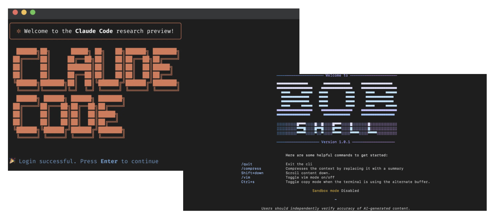

# Coding Harness — Components of a Coding Agent

## How coding agents make LLMs work better in practice with tools use, memory, and repo context
“AI agents will transform the way we interact with technology, making it more natural and intuitive. They will enable
us to have more meaningful and productive interactions with computers.” — Fei-Fei Li, Professor of
Computer Science at Stanford University

Agents have become an pervasive topic because much of the recent progress in practical LLM systems is
not just about better models, but about how we use them. In many real-world applications, the surrounding system,
such as tool use, context management, and memory, plays as much of a role as the model itself.
This also helps explain why systems like Claude Code or Codex can feel significantly more capable
than the same models used in a plain chat interface.

In this article, we will discuss, six of the main building blocks of a coding agent.

## Coding Agents — Claude Code, Codex CLI, and others
You are probably used or familiar with Claude Code or the Codex CLI, but just to set the stage — they are
agentic coding-productivity tools that wrap an LLM or their evolved cousins — in an application layer, a so-called
agentic harness, to be more convenient and better-performing for coding tasks.

Coding agents are engineered for software work where usage pleasantness is not defined only by the model
choice but the surrounding system, including repo context, tool design, prompt-cache stability, memory,
and long-session continuity.

That distinction matters because when we talk about the coding capabilities of LLMs, people often collapse
the model, the reasoning behavior, and the agent product into one thing. But before getting into the
coding agent specifics, it’s important to add more context on the difference between the broader concepts,
the LLMs, reasoning models, and agents.