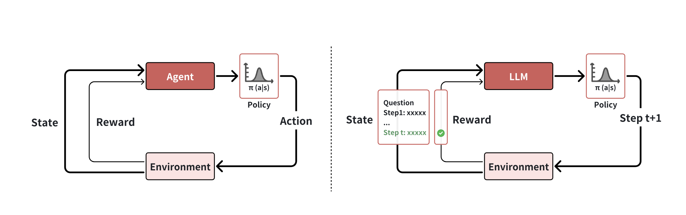

Universe is a ‘hard disk’ full of stimuli. Human brain, transforms these stimuli into data, and data into information, through the cognitive functions. Through
the information we receive, we start the hunt of acquiring more and more knowledge.

Ackoff (1989) in his article From Data to Wisdom proposed a model (wisdom hierarchy) including the following levels:

** Data --> Information --> Knowledge --> Insight --> Wisdom **

His model could be considered as pyramid as each level includes the previous levels.

Analogously, through software systems, we have created means to capture data, the persuit remains to gain knowledge, insight and wisdom
in an efficient way and cost-effective way. Efficiency implies
- Time taken to arrive at an actionable insight
- Reliability of the insight

LLM and [Reasoning model](https://ai.mukeshkr.me/reasoners/) provides **agency** (autonomous) to further reduce the time.

With LLM, we have language based world model which can predict output given a natural language ask. Through it training over large internet level data,
it has learned the latent rules which underlie human language.

Building agents with LLM (large language model) as its core controller is a cool concept. In a LLM-powered autonomous agent system,
LLM functions as the agent’s brain, complemented by several key components:
- Planning (sub-goal, decomposition, reflection and refinement)
- Memory (short-term : in-context, long-term: retain and recall over extended periods)
- Tool use (Means to bring current information, access to proprietary information sources and more)

These two technologies together provide an means to add *agency* (autonomous) to the journey from data to insight, which almost seems magical.

Performance of reasoning models consistently improves with increasing the computation of reinforcement learning and
inference. This denotes 2 paradigm shifts
- From (self-)supervised learning toward reinforcement learning
- From scaling solely training computation to scaling both training and inference computation.

### Background
Let us introduce some background of reinforcement learning and its connection to LLM in this section. Unlike other
learning paradigms, reinforcement learning learns through interaction with the environment, rather
than learning from a static training dataset. In reinforcement learning, an agent learns by receiving
rewards from the environment as it explores. The below figure illustrates the interaction between agent and
environment in reinforcement learning for LLM.

<h4>The visualization of the interaction between agent and environment in reinforcement
learning for LLMs. Left: traditional reinforcement learning. Right: reinforcement learning for LLMs.
The figure only visualizes the step-level action for simplicity. In fact, the action of LLM can be either
token-, step-, or solution-level. </h4>

#### Agent

Agent is the entity that interacts with environment, which makes decision according to its
policy. Formally, a policy π is a mapping from states to actions. It is often represented as a probability
distribution (π(a|s)) over actions given a state s, where the agent selects actions based on these
probabilities.

In the context of LLMs, an agent refers to LLM itself, its policy specify the probability distribution
of either token-, step-, or solution-level actions based on the current state. The state st consists of the
input provided to the model at time t, including both user inputs and the model’s earlier outputs. The
action taken by the model can vary depending on the problem setting; it involves generating a single
token, completing a step, or providing a solution.

#### Environment
Environment refers to the system or world outside the agent. It responds to agent’s
actions and provide feedback in terms of next state st+1 and rewards r(st, at)

Environmental feedback can be categorized as either deterministic or stochastic. Stochastic feedback
is characterized by a transition distribution p(st+1, rt+1|st, at), as seen in systems like dialogue
models, where user responses are inherently unpredictable. On the other hand, deterministic feedback
involves no randomness, yielding a fixed next state st+1 and reward r(st, at). For instance, when a
LLM solves a mathematical problem, the transition is deterministic, where the current state st and
action at are combined to produce the next state st+1.

### LLM as a policy

#### Policy Initialization
Training an LLM from scratch using reinforcement learning is exceptionally
challenging due to its vast action space. Fortunately, we can leverage extensive internet data to pre-
train a language model, establishing a potent initial policy model capable of generating fluent language
outputs. Moreover, prompt engineering and supervised fine-tuning help models acquire human-like
reasoning behaviors, enabling them to think systematically and validate their own results. These
approaches enable models to thoroughly explore their solution spaces, leading to more comprehensive
problem-solving capabilities.

#### Reward Design
Both search and learning require guidance from reward signals to improve the
policy. There are different levels of action granularity, each corresponding to varying levels of reward
signals granularity, which can be explored further. Additionally, these signals are often sparse or even
nonexistent in many environments. To transform sparse outcome reward to dense process reward,
there are some reward shaping methods [Ng et al., 1999](https://people.eecs.berkeley.edu/~pabbeel/cs287-fa09/readings/NgHaradaRussell-shaping-ICML1999.pdf). For the environment where the reward
signal is unavailable, like the task of story writing, we can learn a reward model from preference data
[Bai et al., 2022a](https://doi.org/10.48550/arXiv.2204.05862) or expert data [Ng & Russell, 2000](https://ai.stanford.edu/~ang/papers/icml00-irl.pdf).
The construction of reward model can further evolve into building a world model [Dawid & LeCun, 2023](https://doi.org/10.48550/arXiv.2306.02572).

#### Search
Search plays a crucial role during both the training and testing phases. The training
time search refers to generating training data from search process. The advantage of using search
to generate training data, as opposed to simple sampling, is that search yields better actions or
solutions—i.e., higher-quality training data—thereby enhancing learning effectiveness. During
inference, search continues to play a vital role in improving the model’s sub-optimal policies. For
instance, AlphaGo [Wan et al., 2024](https://openreview.net/forum?id=C4OpREezgj) employs Monte Carlo Tree Search (MCTS) during testing
to enhance its performance. However, scaling test-time search may lead to inverse scaling due to
distribution shift: the policy, reward, and value models are trained on one distribution but evaluated
on a different one [Gao et al., 2023](https://proceedings.mlr.press/v202/gao23h.html).

#### Learning
Learning from human-expert data requires costly data annotation. In contrast, reinforce-
ment learning learns through interactions with the environment, eliminating the need for expensive
data annotation and offering the potential for superhuman performance. In this roadmap, reinforcement learning utilizes
data generated by search for learning via policy gradient or behavior cloning.
Policy gradient methods have high data utilization, as they leverage both positive and negative
solutions, whereas behavior cloning is advantageous in terms of simplicity and memory efficiency. A
prominent example of the iterative interaction between search and learning is AlphaGo Zero [(Silver
et al., 2017](https://doi.org/10.1038/nature24270), which combines Monte Carlo Tree Search (MCTS) (Metropolis & Ulam, 1949) as the
search algorithm with behavior cloning as the learning method, ultimately achieving superhuman
performance in the game of Go.

### References
[1] Ackoff, R. L. (1989). From data to wisdom. Journal of applied systems analysis, 16(1), 3-9.