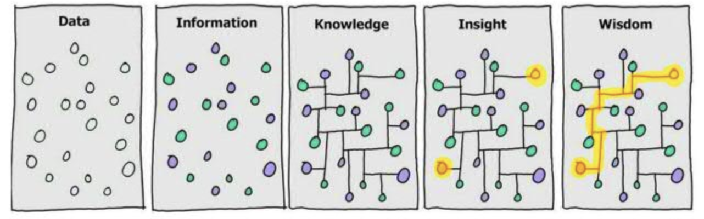
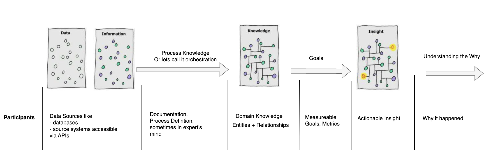
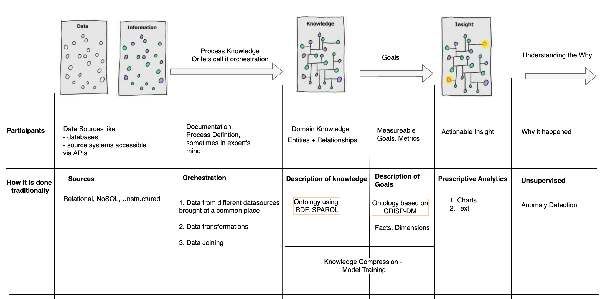

Universe is a ‘hard disk’ full of stimuli. Human brain, transforms these stimuli into data, and data into information, through the cognitive functions. Through
the information we receive, we start the hunt of acquiring more and more knowledge.

Ackoff (1989) in his article [1] **From Data to Wisdom**  proposed a model (wisdom hierarchy) including the following levels:

**Data --> Information --> Knowledge --> Insight --> Wisdom**

His model could be considered as pyramid as each level includes the previous levels.

Analogously, through software systems, we have created means to capture data, the persuit remains to gain knowledge, insight and wisdom
in an efficient and cost-effective way. Efficiency implies
- Time taken to arrive at an actionable insight
- Reliability of the insight

LLM and [Reasoning model](https://ai.mukeshkr.me/reasoners/) provides **agency** (autonomous) to further reduce the time.

With LLM, we have language based world model which can predict output given a natural language ask. Through it training over large internet level data,
it has learned the latent rules which underlie human language.

Building agents with LLM (large language model) as its core controller is a cool concept. In a LLM-powered autonomous agent system,
LLM functions as the agent’s brain, complemented by several key components:
- Planning (sub-goal, decomposition, reflection and refinement)
- Memory (short-term : in-context, long-term: retain and recall over extended periods)
- Tool use (Means to bring current information, access to proprietary information sources and more)

These two technologies together provide an means to add *agency* (autonomous) to the journey from data to insight, which almost seems magical.

With these AI transformative tools, it seems everything is figured out. Right? **Wrong**. While the pieces are there,
- Scaffolding is missing.
- Data is distributed across heterogeneous data sources and have different formats.
- Absence of 360 degree view on relevant data
- Semantic Similarity based Information Retrieval(IR) has TOP_K curse.
- LLMs are not good with numbers but are good with non-numeric generation tasks like abstractive summarization, creative writing.
- Grounding LLM to prevent hallucinations
- Stochasticity curse

All above results into reliability concerns wrt to the quality of IR and response generation.

### Introduction
In the current article, we will the present the approaches followed in pre-LLM world in the journey from *Data to Insight*
We will discuss
- Participants in the journey from *Data to insight*
- How it was being done in the pre-LLM world

The understanding will provide to understand the benefits and shortcomings of introducing LLM based agency.

### The Participants

#### DataSources
Enterprises has data take different forms
- Structured, Semi-structured or Unstructured

Further data can be
- Transactional data (Applications, API) - OLTP
- Analytical data (OLAP)

#### Process Knowledge
Which data are needed for insight and how to bring the data. This can be referred to as **orchestration**.
These knowledge is present in product documentations, expert's process knowledge.

#### Domain Knowledge
How different concepts relate to each other. Experts inject this meaning to data through ontology

> In knowledge representation and AI, an ontology is a formal, structured description of knowledge — it defines the concepts (entities), relationships, and rules that describe a particular domain.
Put simply, it’s a schema for meaning — a way to tell machines what things exist, how they relate, and what constraints apply.

> **Deductive and inductive reasoning**
>> *Deductive reasoning* is a basic form of reasoning. It begins with a general statement or hypothesis and examines
the possibilities to reach a specific, logical conclusion. For example, consider the reasoning: “All men are mortal.
Alessandro is a man. Therefore, Alessandro is mortal.” With deductive reasoning, the hypothesis must be correct.
It is assumed that the premises, “All men are mortal” and “Alessandro is a man,” are true. Therefore, the conclusion
is logical and true.

 
>> *Inductive reasoning* makes broad generalizations from specific observations. It starts with data that includes samples of reality and then draws conclusions. For example, “The coin I pulled from the bag is a penny. The second and the third coins from the bag are pennies. Therefore, all the coins in the bag are pennies.” Note that even if all the premises are true in the original statement, inductive reasoning can lead to false conclusions. Here’s an example: “Harold is a grandfather. Harold is bald. Therefore, all grandfathers are bald.” In this case, the conclusion does not follow logically from the statements.

Ontology based knowledge representation allows for Deductive Reasoning. Model based prediction/reasoning allows for Inductive reasoning

#### Goals
When we need to analyse data, certain amount of probing is required. Probing needs goals in expert's mind based on the domain of interest. Different domains
would have different goals in mind. For example CSM would be interested in customer churn and indicators capturing those.

In traditional Data Science, this is referred to as dimensions.

#### Explaining a pattern
Once an insight has been presented, there is often a need to understand the why. For eg if in product quality, if the number of
tickets have dipped suddenly, the need to understand the why can indicate a holiday month like Christmas.

Traditional ML techniques like anomaly detection has been used to understand the underlying cause

### How it was done traditionally

The journey from data to insight would begin with an analyst
- Bringing in data from different data sources based on process knowledge
- Merging data based on domain knowledge
- Arriving on goals based on domain knowledge
- Presenting the dimensions in form of charts or texts
- Explaining anomaly using ML methods like Anomaly detection etc

> Analyst can be Data Analyst or Scientist or Business Analyst.
> More often than not, Data Scientists generally take pro-code approach while business analyst would rely
> on no-code or low-code tools like Tableau etc

### Looking Forward

While the *Data to Insight* life-cycle introduces determinism in the results, it is far from being an intelligent system

**Characteristic of Intelligent System**
 

An intelligent system must include four key characteristics that should drive both design and implementation:

    - *A meaningful objective* —The system should exist for a specific, achievable purpose that is meaningful to end users.
    This objective must drive the entire development process.

    - *The intelligent experience* —The system must present intelligent outputs to users in ways that achieve desired outcomes.
    This requires interfaces that adapt based on predictions, maximize value when intelligence is correct, and minimize costs when
    mistakes occur. The interface must also facilitate implicit and explicit user feedback.

    - *Knowledge creation and update* —Intelligent behavior requires the capability to build, maintain, and reason with knowledge continuously.

    - *Orchestration* —Intelligent systems involve multiple algorithms and tools working together, with the output of one
    becoming input for another.
    This includes managing how the system acquires knowledge from sources, controls risk, and maintains quality throughout
    its lifecycle.

### References
[1] Ackoff, R. L. (1989). From data to wisdom. Journal of applied systems analysis, 16(1), 3-9.