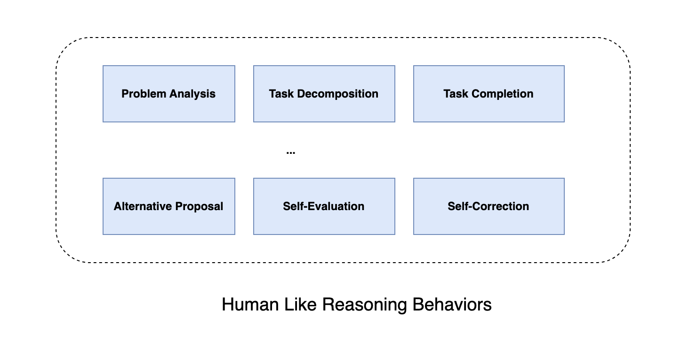

Reasoning models like OpenAI's o1 to o3 and Deepseek's zero to R1  represents a significant milestone in Artificial
Intelligence which achieves expert-level performances on many challenging tasks that require strong reasoning ability.
They can generate very long reasoning process and conduct human-like reasoning actions like clarifying and decomposing
questions, reflecting and correcting previous mistakes, exploring new solutions when encountering failure modes.

While instruction-tuned models demonstrate general task competency and user intent understanding,
reasoning models require a more sophisticated repertoire of human-like reasoning capabilities to fully
leverage their potential.

#### Problem Analysis
Problem analysis serves as a crucial initialization process where the model reformulates and analyzes the problem before
solving it [(Kondrakunta et al., 2018)](https://www.cse.lehigh.edu/~munoz/Publications/GRExplanation2018.pdf). This process
involves multiple steps: explicit problem restatement to verify understanding, identification of implicit
constraints, and transformation of abstract requirements into concrete, actionable specifications

#### Task Decomposition
When encountering complex problems, humans typically decompose them into several manageable subtask. The decomposition process
is adaptive and context-aware.

#### Task Completion
Following problem analysis and task decomposition, the model generates solutions through step-by-step reasoning based
on clarified problems and decomposed subtasks. This behavior forms the foundation for all other reasoning processes,
where successful solutions lead to subsequent subtask processing, while problematic solutions trigger
the generation of alternatives or self-correction behaviors. Step-by-step generation significantly
enhances models’ complex reasoning capabilities

#### Alternative Proposal
When faced with reasoning obstacles or dead ends, the ability to generate diverse alternative solutions becomes crucial.
This systematic exploration of alternatives not only expands the search space but also enables iterative refinement
through solution comparison, leading to more well-reasoned outputs.

#### Self-Evaluation
Following task completion, self-evaluation serves as a critical verification mechanism to validate the correctness
of proposed solutions. This evaluation capability can be enhanced through two primary approaches: implementing detailed
evaluation criteria to instill self-evaluation abilities or utilizing self-debate for cross-validation

#### Self-Correction
When encountering manageable errors in the reasoning process, models employ self-correction behaviors to address them.

OpenAI has outlined a [5-stage roadmap to AGI](/open-a-is-5-stages-to-agi/), with stage 2 focusing on becoming a strong reasoner, stage 3 centered on becoming an
agent. The model like OpenAI's o1 to o3 and Deepseek's R1 has already reached stage 2, achieving reasoning capabilities on par with human
experts.

### LLM as a policy - Problem Formulation

[LLM as a nlp based policy](/llm-as-a-reasoning-agent/)

### Engineering
- [Open-R1: a fully open reproduction of DeepSeek-R1](https://huggingface.co/blog/open-r1)
    - [Github link](https://github.com/huggingface/open-r1)

### References
- [Scaling of Search and Learning: A Roadmap to Reproduce o1 from Reinforcement Learning Perspective](https://arxiv.org/pdf/2412.14135v1)
- [Agent Q: Advanced Reasoning and Learning for Autonomous AI Agents](https://arxiv.org/pdf/2408.07199)
- [DeepSeek-R1: Incentivizing Reasoning Capability in LLMs via
Reinforcement Learning](https://arxiv.org/pdf/2501.12948v1)