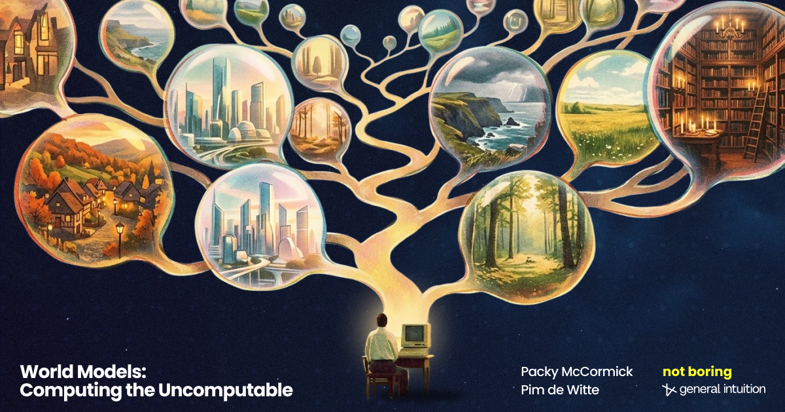
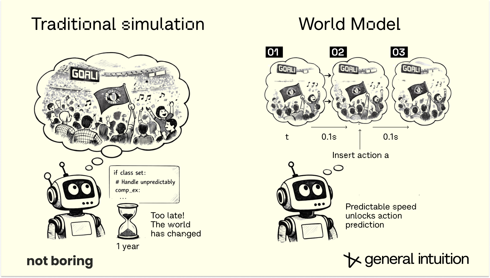
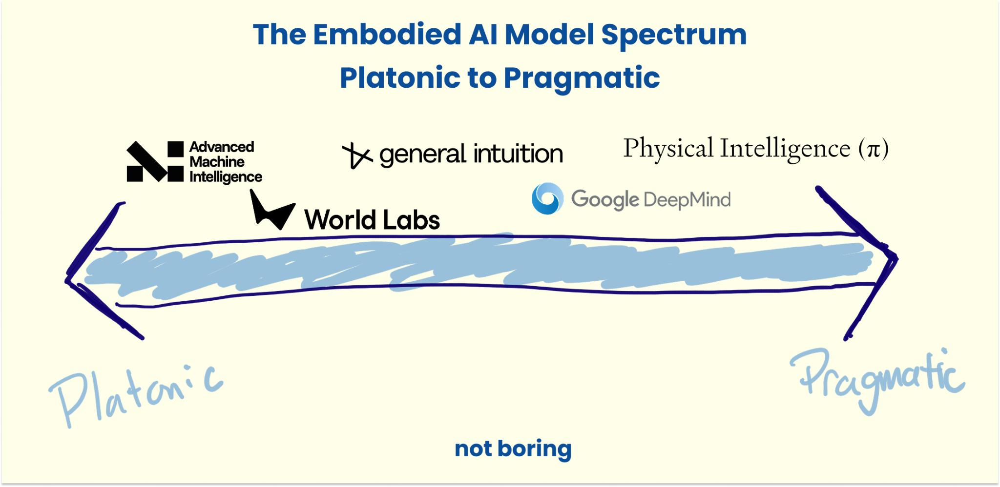
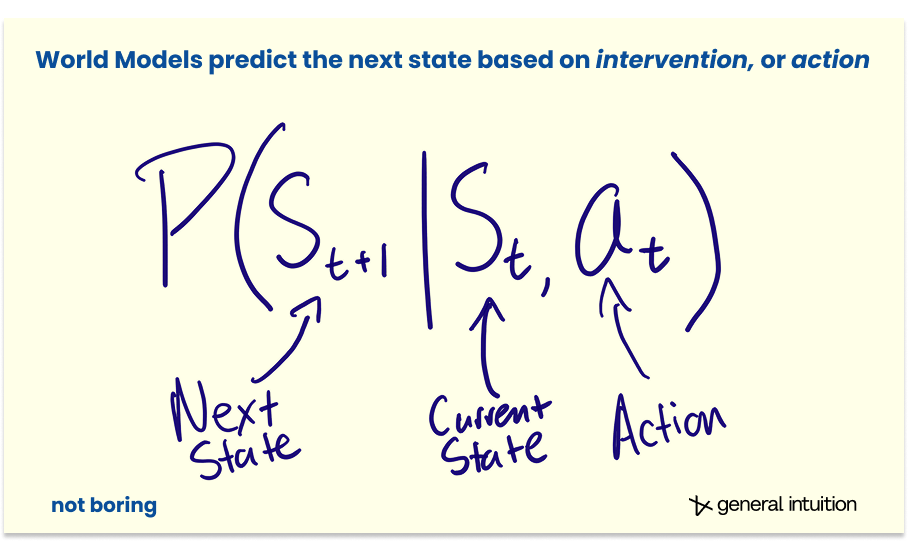
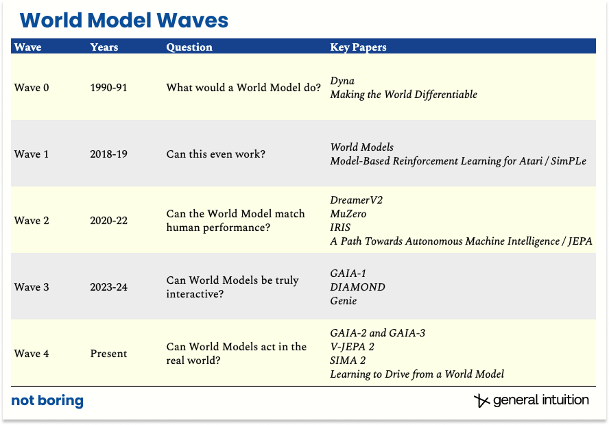

Every major AI breakthrough of the last five years has been built on next-token prediction. It
is a spectacularly good trick with one blind spot: language is a lossy compression of reality.
Words point at the world; they don't contain it. "World models" is the loosely defined phrase for
the systems meant to close that gap, and it currently gets applied to everything from a
text-to-video generator to a robot's internal planner [1, 2].

Many researchers frame the useful question not as "does this system have a world model" but as
"which part of the agent loop is it modeling". A useful reference point is the partially observable
Markov decision process (POMDP): an agent takes an action, the world's state changes, the agent
receives a *partial* observation of the new state, and it decides its next action from that
observation [1]. Turning a state into something visible, predicting how a state changes, and
deciding what action to take next are three different jobs. Conflating them under one label is
most of why the term feels slippery [1].

### A functional taxonomy

Sorting these systems by what they actually output produces three fairly distinct categories [1].

#### Renderers
They turn a state into an observation a human can look at — pixels optimized for visual fidelity
rather than physical correctness. Text-to-video and interactive generative-video products sit here.
They can produce a gorgeous clip of a bouncing ball that quietly violates physics, because visual
plausibility was the only training objective [1].

#### Simulators
They produce structured, inspectable representations of state — geometry, physics, dynamics — that
hold up under scrutiny from both humans and machines. This is the least glamorous category and
arguably the most important, because it contains the raw material the other two depend on: you can
render a convincing image from a good simulation, but you cannot derive a good simulation from a
rendered image after the fact [1].

#### Planners
They take an observation and a goal and output a sequence of actions, closing the loop back to
behavior. This is the domain of vision-language-action models and the emerging class sometimes
called world-action models [1, 2].

<video
  src="/world-models/renderer-planner.mp4"
  poster="/world-models/renderer-planner-poster.jpg"
  autoPlay
  loop
  muted
  playsInline
  style={{ width: `100%`, height: `auto`, borderRadius: `4px`, marginTop: `2rem`, marginBottom: `2rem` }}
/>

The frontier claim is that these are being built as three separate products by companies chasing
different demos, when the underlying knowledge each needs — how objects move, how surfaces
interact, what tends to happen next — should be the same knowledge, differently projected. A
handful of systems now output more than one at once from a single model [1].

<video
  src="/world-models/unified-world-model.mp4"
  poster="/world-models/unified-world-model-poster.jpg"
  autoPlay
  loop
  muted
  playsInline
  style={{ width: `100%`, height: `auto`, borderRadius: `4px`, marginTop: `2rem`, marginBottom: `2rem` }}
/>

### Two philosophies: predict everything, or predict what matters

Orthogonal to that taxonomy is a divide over how a world model decides what to predict [2].

*Generative* world models predict the future by generating it in full — actual pixels and frames a
person can sanity-check. Interpretable, but computationally expensive, because the model must
commit to details that may not matter for the task.

*Latent* world models predict forward in an abstract, compressed representation space and
deliberately decline to reconstruct visual detail. The reasoning: most of what happens frame to
frame is genuinely unpredictable and not worth modeling, while the part that matters for planning
is comparatively low-dimensional. Throwing away the unpredictable detail on purpose is the whole
design philosophy [2].

Neither approach has definitively won, and the split tracks a broader disagreement about what
"understanding" a scene means: being able to picture it, or being able to predict the parts of it
governed by rule rather than noise.

### What a world model is not

It is not a plain video model, which predicts the statistically likely next frame with no
reference to what anyone did — a passive extrapolation. A world model predicts what happens *given
a specific action*, a quantity that can be queried, steered, and used for planning [1, 2]. And it
is not a policy — the separate component that decides *which* action to take. The world model is
the internal simulator; the policy is the decision-maker that consults it [2].

Action-conditioning is also the source of the efficiency advantage over classical simulation.
Traditional physics-based simulators blow up in cost as the number of interacting agents grows. A
trained world model absorbs interaction patterns into its weights during training and pays a
roughly fixed inference cost regardless of scene complexity — prior experience compressed once, so
physics isn't recomputed from first principles every time [2].

### A brief history: four waves

The idea has a multi-decade lineage [2]. An initial theoretical wave in the early 1990s proposed
making environment dynamics differentiable and planning inside a learned model. A second wave
around 2018–2019 proved basic feasibility: an agent trained to act competently almost entirely
inside a learned internal model, with little real interaction data. A third wave, roughly
2020–2022, pushed these systems from "interesting" to human-level on standard benchmarks while
learning environment rules from scratch. A fourth wave, 2023–2024, was about interactivity and
scale: models trained on real-world driving footage, richer fidelity through diffusion, and
autoregressive transformers at larger scale.

The current wave is about deployment — world-model-trained driving policies in production vehicles,
robot manipulation showing zero-shot generalization, autonomous-driving systems handling complex
real-world scenarios rather than curated test tracks [2].

### Why the money is moving this way

Multiple companies working on world models for spatial intelligence, autonomous driving, and
robotics have raised at multi-billion-dollar valuations in the past two years, and large incumbent
labs have stood up dedicated efforts [2]. The scale of investment reflects a widespread — not
universal — bet that grounding AI in physical, embodied prediction is a more durable path to
general capability than scaling language alone. The commercial framing clusters around three end
markets: robotics (rehearsing a task safely before attempting it physically), autonomous vehicles
(predicting what other drivers and pedestrians will do), and spatial content generation (explorable,
physically coherent environments rather than fixed clips) [2].

### What's still unsolved

- **Imbalanced training data.** Near-infinite ordinary video for renderers, comparatively little
  verified, physically accurate 3D data for simulators — the harder and more valuable category [1].
- **The sim-to-real gap.** Narrowed but not closed; most impressive robotics demos still run in
  constrained lab conditions with few objects and short horizons [2].
- **Deceptive 3D geometry.** AI-generated geometry can look correct at a glance while encoding
  physical impossibilities that only surface on contact [1].
- **Cost of high-fidelity multi-physics simulation.** Still expensive even with learned shortcuts,
  which caps real-time scene complexity [2].
- **Definitional dilution.** "World model" is becoming a marketing term for any product that
  generates video or plans actions, regardless of whether it models causal, action-conditioned
  dynamics — which makes real progress harder to evaluate from the outside [1].

### The bigger bet

Underneath the detail sits one wager: that language alone tops out as a substrate for general
intelligence, and the next real gains come from systems that have learned physical cause and effect
by observing and acting in an environment rather than reading descriptions of one. Whether it pays
off is unsettled — the historical pattern is that narrow demonstrations take years longer than
expected to generalize — but the direction of travel across labs, startups, and incumbents is
unusually aligned: the next jump looks less like a bigger language model and more like a system
that has learned what happens when you let go of the ball.

### References
- \[1\] [Fei-Fei Li and the World Labs team. A Functional Taxonomy of World Models. Substack, June 2026.](https://drfeifei.substack.com/p/a-functional-taxonomy-of-world-models)
- \[2\] [Packy McCormick and Pim de Witte. World Models: Computing the Uncomputable. Not Boring, March 2026.](https://www.notboring.co/p/world-models)

*Diagrams in this piece are sourced from the two articles above and remain the property of their original creators.*
